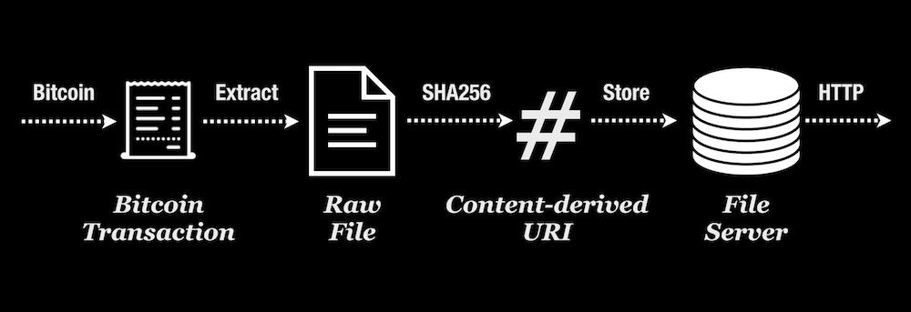

# C://

> Content Addressable Files over Bitcoin

# 1. Immutable

C:// is an immutable URI scheme for referencing B:// protocol files, a simple Bitcoin file storage protocol.

The file system is constructed from Bitcoin transactions, and is instantly serviced through HTTP/HTTPS endpoint.

# 2. Content Addressable

C:// generates filenames by SHA256-hashing the content uploaded through Bitcoin.

This means there's exactly one universal filename per unique content. (Known as Content Addressable Storage)

# 3. Trustless

With B://'s default URI scheme, users can't verify authenticity of the files sent from B:// servers with 100% certainty. You still need to rely on a 3rd party Bitcoin node to verify, which involves trust.

With C://, every file URI is uniquely derived from its contents (not transaction id, but the SHA256 hash of the file buffer itself), so you can be 100% confident of the authenticity of the files you reference using the C:// scheme.

---

> **Learn More at [https://c.bitdb.network/](https://c.bitdb.network/)**
